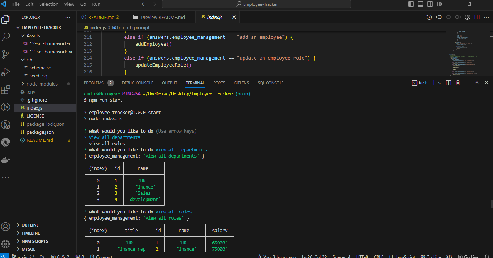

# 12 SQL: Employee Tracker

## Description

Developers frequently have to create interfaces that allow non-developers to easily view and interact with information stored in databases. These interfaces are called **content management systems (CMS)**. Your assignment this week is to build a command-line application from scratch to manage a company's employee database, using Node.js, Inquirer, and MySQL.

Because this Challenge will require the use of the `Inquirer` package, ensure that you install and use Inquirer version 8.2.4. To do so, use the following command in your project folder: `npm i inquirer@8.2.4`.

Because this application won’t be deployed, you’ll also need to create a walkthrough video that demonstrates its functionality and all of the following acceptance criteria being met. You’ll need to submit a link to the video and add it to the README of your project.

## User Story

```md
AS A business owner
I WANT to be able to view and manage the departments, roles, and employees in my company
SO THAT I can organize and plan my business
```

## Acceptance Criteria

```md
GIVEN a command-line application that accepts user input
WHEN I start the application
THEN I am presented with the following options: view all departments, view all roles, view all employees, add a department, add a role, add an employee, and update an employee role
WHEN I choose to view all departments
THEN I am presented with a formatted table showing department names and department ids
WHEN I choose to view all roles
THEN I am presented with the job title, role id, the department that role belongs to, and the salary for that role
WHEN I choose to view all employees
THEN I am presented with a formatted table showing employee data, including employee ids, first names, last names, job titles, departments, salaries, and managers that the employees report to
WHEN I choose to add a department
THEN I am prompted to enter the name of the department and that department is added to the database
WHEN I choose to add a role
THEN I am prompted to enter the name, salary, and department for the role and that role is added to the database
WHEN I choose to add an employee
THEN I am prompted to enter the employee’s first name, last name, role, and manager, and that employee is added to the database
WHEN I choose to update an employee role
THEN I am prompted to select an employee to update and their new role and this information is updated in the database 
```

## Mock-Up

The following video shows an example of the application being used from the command line:



## Motivation

I was motivated to create this project to learn more about SQL and databases.  I was also motivated to create this project to learn more about Node.js and Inquirer as this project adds new functionality to skills I have just recently learned.

## Why

I believe this project is important because it builds on my previous knowledge of Node.js and inquirer while introducing me to SQL and databases. This project will help me to understand how to use SQL and databases in future projects.

## What problem does it solve

This will help business owners and managers to view and manage the departments, roles, and employees in their company.  In addition this application will help them to organize and plan their business.

## What did you learn

I learned the importance of primary and foreign keys in SQL and databases.  I also learned how create shcemas and seed files to create and populate databases.  I also learned how to use SQL to create, read, update, and delete data from databases. I also learned how to use Node.js and Inquirer to create a command line application that interacts with a database.

## What makes your project stand out

My project stands out because it is an excellent introduction to sequelize implementing mysql2, teaching me how to design models and create associations between them using primary and foreign keys.

## Installation

npm install to install all dependencies and then npm start to run the application.

## Usage

This application can be used to view and manage the departments, roles, and employees in a company.  It can also be used to organize and plan a business.

### Link to Github Repository

<https://github.com/precisecoding/Employee-Tracker>

### Link to Walkthrough Video

<https://drive.google.com/file/d/1my7F9g6Lx3UeNnV0wqjVisI5wqepXiNF/view>

### License

MIT License: <https://opensource.org/licenses/MIT> <https://choosealicense.com/licenses/mit/> LICENSE file included in repository.

### Thanks to everyone for support and contributions

Sources used: <https://developer.mozilla.org/en-US/>, <https://www.w3schools.com/>, <https://stackoverflow.com/>. 